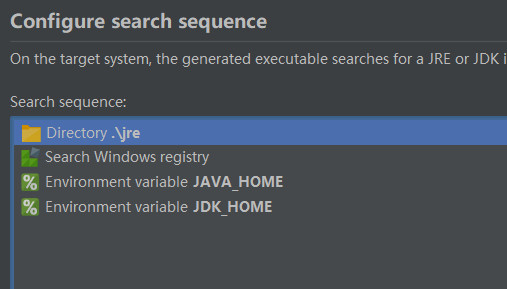

## DxBall

### 介绍

用Java语言复刻经典游戏打砖块，通过学习可以深入理解图形编程，面向对象编程，并发编程等。

### 运行教程

如果不开发，那么只要系统安装了版本大于等于16的JDK并配好环境变量，可以直接运行DxBall.exe进入游戏。

### 开发教程

- 安装版本大于等于16的JDK并配好环境变量；
- 克隆项目，IDEA中导入项目，即可开始开发；
- 通过Project Structure中的Artifacts指定导出的Jar包；
- 通过Build下的Build Artifacts即可在out下生成Jar包；
- 配置EXE4J_JAVA_HOME变量指向Jdk根目录，然后安装exe4j；
- 打开DxBall.exe4j，开始自己的配置，其中最关键的是如下配置：
    
    
    第一个是额外指定的，优先搜索当前目录下的jre，其他三个为默认选项。
